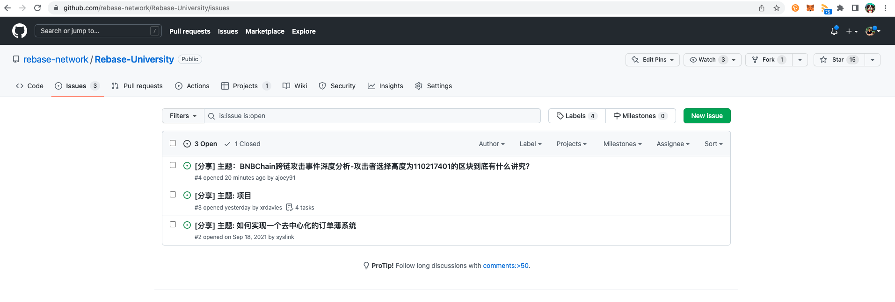

## 如何在 Rebase 大学提交你想进行的话题

Rebase 大学的内容管理依赖于 Github 这个平台所提供的功能，目前课程表展示采用 Github 提供的 **Project** 功能，课表信息的收集则是基于 **issue**，同时依赖 **Github Action** 来做相关的自动化发布。感谢 Github 所提供的平台，让我们能够以完全开放的方式来进行 Rebase 大学的内容组织。

遇到任何问题请联系微信 **ljyxxzj**, **liushooter2021**, 或 **xrdavies**

### 创建issue
如图，前往 [https://github.com/rebase-network/Rebase-University/issues](https://github.com/rebase-network/Rebase-University/issues)  

点击 **New Issue** 创建一个新的 **issue**。如图，填写你想提交分享的话题，如进行分享的日期、时间、主题、内容简介、主讲人及参考资料等等。内容尽可能完善，这样方便小编在 Rebase 社区进行活动招募。  

### 设置话题类型
如图，点击右侧的 **Labels**，从相应的标签里选择这个话题所属的类型。目前已经尝试过的话题有 **CodeReview**, **产品解读**，**安全分析**，**白皮书解读**，**技术解读** 等五种类型。有任何其他想要添加的类型可以在社区联系我们。

### 关联到 Projects
如图，点击右侧的 **Projects**，并选择 **Rebase大学分享课表**

在关联上课表后还需要补充相应的信息，如图，在右侧 **Rebase大学分享课表** 输入分享人、分享时间、分享日期即可。所有信息都填写完成后即可点击提交 issue。

### 查看课表信息

创建完后可以跳转到 [https://github.com/orgs/rebase-network/projects/1/views/1](https://github.com/orgs/rebase-network/projects/1/views/1) 查看提交的话题信息。

